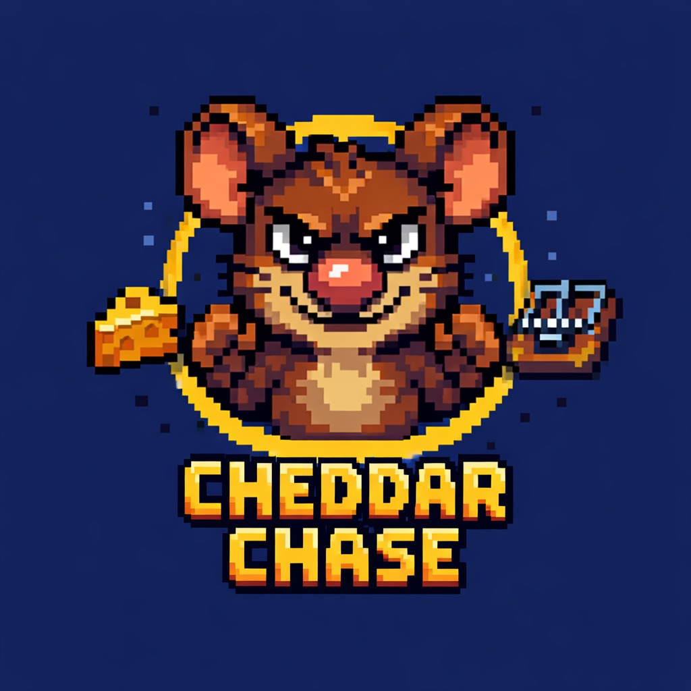
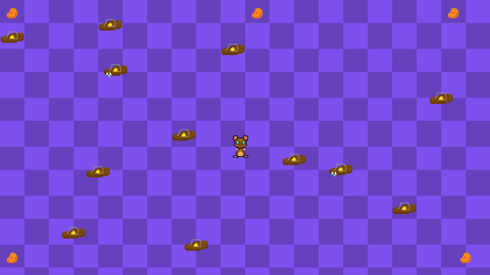
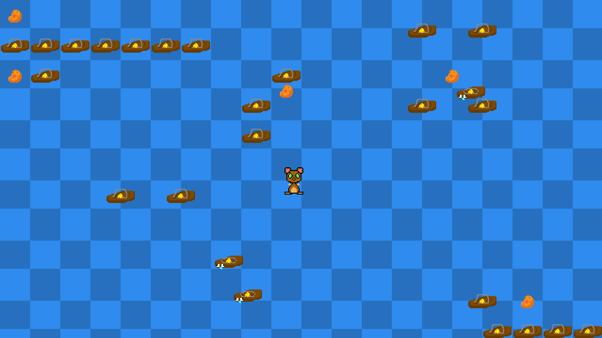
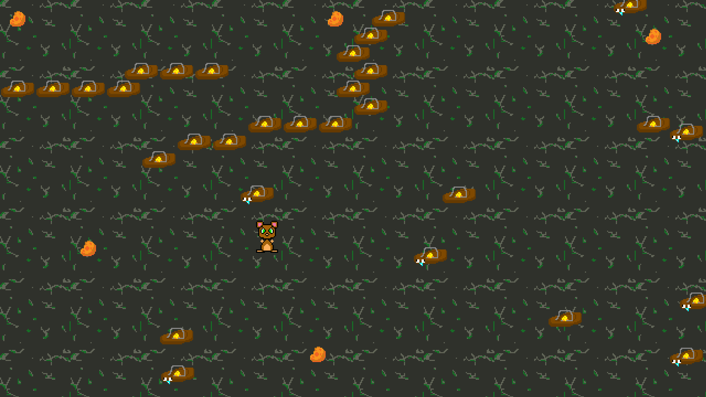

# 🧀 Cheddar Chase

<p align="center">
  
</p>

<p align="center">
  <b>Um jogo 2D em pixel art sobre um rato em busca de queijo enquanto evita armadilhas perigosas.</b>
</p>

---

# 🎮 Sobre o jogo

**Cheddar Chase** é um jogo **2D em pixel art** desenvolvido utilizando a engine **GameMaker**.

No jogo você controla um rato que precisa coletar **5 pedaços de queijo** espalhados pela fase enquanto desvia de **ratoeiras perigosas**.

O desafio é **pegar todos os queijos sem tocar em nenhuma ratoeira**.

Existem dois tipos de obstáculos:

- 🪤 **Ratoeiras fixas**
- 🪤 **Ratoeiras móveis**

Ao coletar todos os queijos da fase, o jogador **avança para a próxima**.

---

# 📸 Screenshots

<p align="center">
  
</p>

<p align="center">
  
</p>

<p align="center">
  
</p>

---

# 🎮 Controles

| Tecla              | Ação                       |
| ------------------ | -------------------------- |
| ⬆⬇⬅➡               | Movimentar o rato          |
| **Espaço**         | Iniciar o jogo             |
| **F11**            | Alternar tela cheia        |
| **Qualquer tecla** | Jogar novamente após o fim |

---

# 🕹️ Gameplay

Objetivo de cada fase:

- Evitar todas as ratoeiras
- Coletar **os 5 queijos**
- Avançar para a próxima fase

Se o jogador tocar em uma ratoeira, a fase **recomeça**.

---

# 💾 Como instalar e jogar

1. Baixe o arquivo **.zip** disponível no repositório.
2. Extraia o arquivo em qualquer pasta do seu computador.
3. Abra a pasta extraída.
4. Execute o arquivo:

```
Cheddar Chase.exe
```

O jogo abrirá normalmente e você já poderá jogar.

---

# 🧱 Tecnologias utilizadas

- **GameMaker**
- **GML (GameMaker Language)**
- **Pixel Art**

---

# 🎯 Objetivo do projeto

Este jogo foi criado como meu **primeiro projeto completo de jogo**, com o objetivo de:

- Aprender a utilizar a engine **GameMaker**
- Entender a lógica de jogos **2D**
- Praticar **programação de gameplay**
- Criar **sprites e assets próprios**
- Experimentar todo o processo de desenvolvimento de um jogo **do zero**

Apesar de ser um jogo simples, ele representa meu **primeiro passo no desenvolvimento de jogos**.

---

# 🚀 Aprendizados

Durante o desenvolvimento deste projeto, pratiquei conceitos importantes como:

- movimentação de personagem
- colisões
- troca de rooms (fases)
- lógica de inimigos
- interface básica
- organização de projeto

---

# 👨‍💻 Autor

Desenvolvido por **Rafael Tunes Mathiensen**

Este projeto faz parte do meu aprendizado em:

- programação
- desenvolvimento de jogos
- criação de arte para jogos
- lógica de gameplay

---

# 📜 Licença

Este projeto foi criado para fins de **estudo e aprendizado**.
